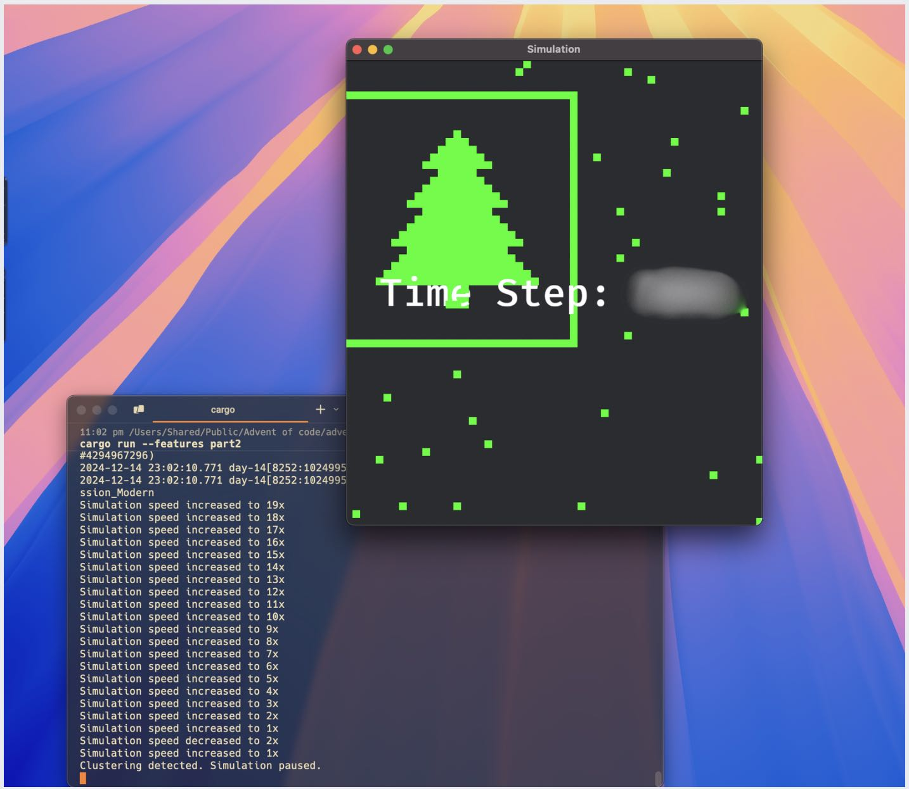

advent_of_code_2024
---

Just my aoc repo this year.

### highlights:

- [day-2](day-2/) when brute force is enough :D
- [day-3](day-3/) [nom](/rust-bakery/nom) is probably heavy for this regex problem. First day I actually used [mry](/ryo33/mry) in testing.
- [day-5](day-5/) first day where a DAG made sense.
- [day-6](day-6/) [game_grid](https://docs.rs/game-grid/latest/game_grid/) , which looks useful for bevy, I could have written a visualization, made the setup a breeze 😀
- [day-13](/day-13) [z3](/Z3Prover/z3) to the rescue! 🚀
- [day-14](/day-14/) A fun [bevy](https://bevyengine.org) day!

- [day-16](/day-16) a natural place to use [pathfinding](/evenfurther/pathfinding) crate! This one led to my first rust crate [pr](/oilandrust/game-grid/pull/1) (to game-grid) from AoC this year.